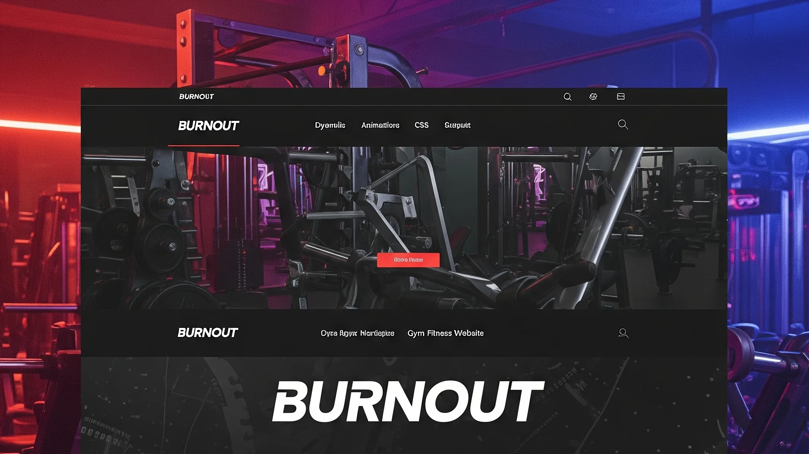
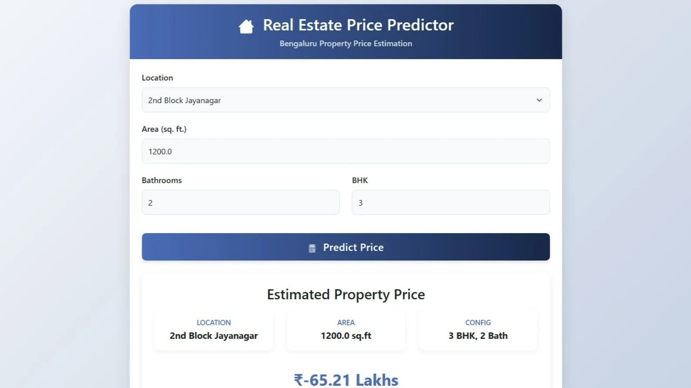

# Rajeeb Portfolio


Welcome to my personal portfolio! 🚀

This is a modern, responsive, and interactive portfolio website built with Flask, HTML, CSS, and JavaScript. It showcases my projects, skills, experience, and certifications, and includes a contact form, live chat, and analytics.

## 🌟 Features
- **Modern Dark UI** with smooth animations
- **Project Gallery** with live links and GitHub repos
- **Skills & Certificates** with modal previews
- **Contact Form** (sends email via EmailJS)
- **Live Chat Widget** (Tawk.to integration)
- **Google Analytics** for visitor tracking
- **Performance Optimized** (WebP images, lazy loading, minified assets)

## 📸 Screenshots
<!-- Add your screenshots here -->



## 🚀 Live Demo
[View Portfolio Live](https://rajeebdas.onrender.com/) <!-- Update with your deployed URL -->

## 🛠️ Setup Instructions
1. Clone the repo:
   ```bash
   git clone https://github.com/Rajeebdas/Rajeeb-Portfolio.git
   cd Rajeeb-Portfolio
   ```
2. Install dependencies:
   ```bash
   pip install -r requirements.txt
   ```
3. Run locally:
   ```bash
   python app.py
   ```
4. Open [http://localhost:5000](http://localhost:5000) in your browser.

## 💬 Contact
- **Email:** dasrajeeb167@gmail.com
- **LinkedIn:** [rajeeb-das-cse](https://www.linkedin.com/in/rajeeb-das-cse/)
- **GitHub:** [Rajeebdas](https://github.com/Rajeebdas)

---

> Made with ❤️ by Rajeeb Das 